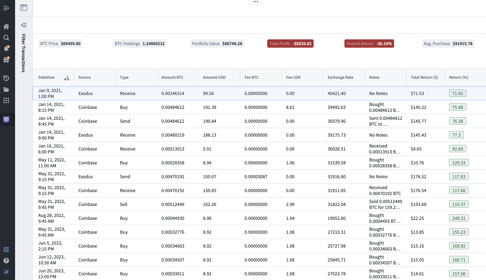
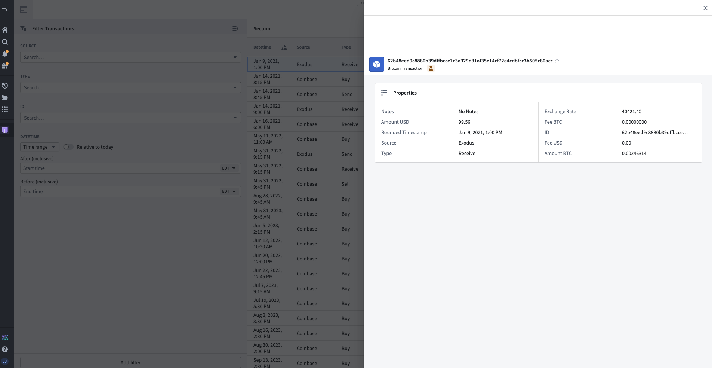
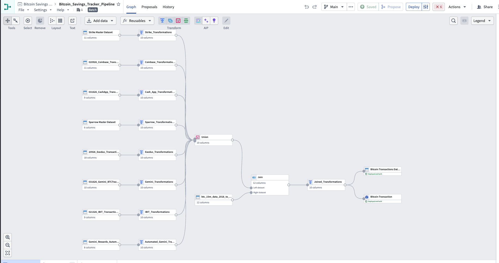
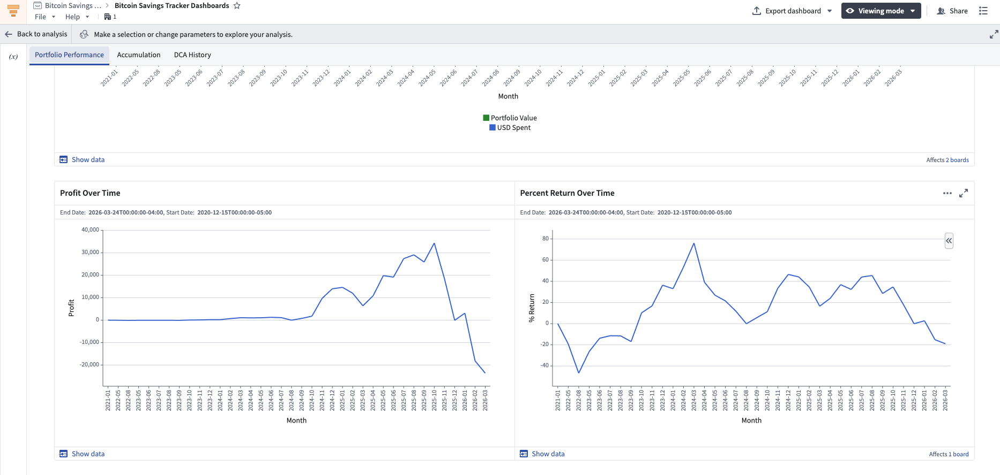
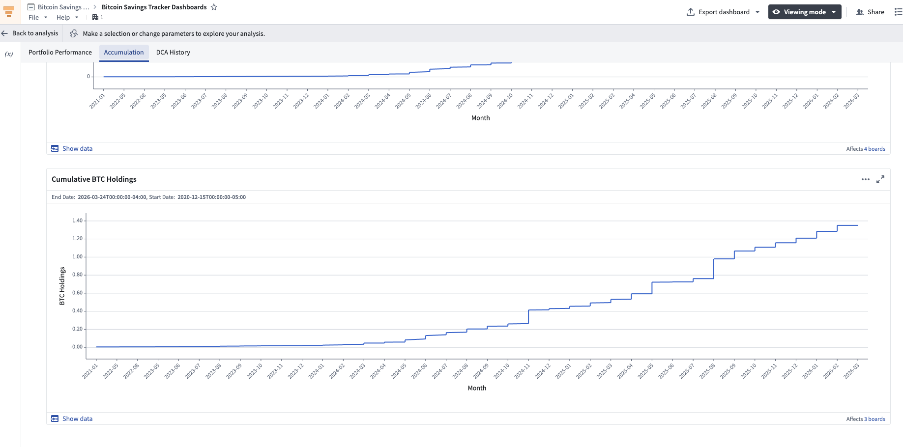

# Bitcoin Portfolio Analytics Engine

A multi-source financial data pipeline built end-to-end in **Palantir Foundry**. Ingests transaction data from 7 sources (API + CSV), standardizes it through Pipeline Builder ETL, backs an Ontology Object Type, and surfaces live portfolio metrics through Foundry Functions, a Workshop application, and a Contour analytics dashboard.

**Foundry tools used:** Transforms (Python) · Pipeline Builder · Ontology · Functions (Ontology SDK) · Workshop · Contour · Magritte (External Sources)

---

## Workshop Application

Live transaction explorer with KPI cards powered by Foundry Functions and real-time Kraken API data.



KPI cards (BTC Price, Holdings, Portfolio Value, Profit, Return %, Avg. Purchase Price) are computed at query time by Foundry Functions calling the Kraken Ticker API. The transaction table includes computed `Total Return ($)` and `Return (%)` columns for every row.



Filter sidebar supports multi-field filtering (Source, Type, ID, Datetime range). Clicking any transaction opens the Object detail panel showing all properties from the `Bitcoin Transaction` Object Type.

## Pipeline Builder

Visual ETL pipeline that standardizes 8 input streams into a unified 10-column schema, then enriches with historical price data.



Each source feeds into a dedicated transformation node, all streams union into a single dataset, then LEFT JOIN with a 15-minute OHLC price dataset to backfill exchange rates. The output backs the `Bitcoin Transaction` Object Type.

## Contour Analytics Dashboard

SQL-driven analytics dashboard with three tabs: Portfolio Performance, Accumulation, and DCA History.





---

## Architecture Overview

The project spans four layers across two Foundry code repositories and a set of no-code Pipeline Builder pipelines.

### Layer 1 — Data Ingestion

- **Automated (API):** A Python transform ([`gemini_rewards_ingestion.py`](../API_Data_Ingestion/transforms-python/src/myproject/datasets/gemini_rewards_ingestion.py)) pulls transactions from the Gemini API using `@incremental()` transforms. Authenticates with HMAC-SHA384 signing, secrets managed through Magritte sources. Each new record is enriched with a BTC/USD price from the Kraken OHLC API at ingestion time.
- **Manual (CSV):** Six additional sources are ingested as CSV uploads. Two active sources (Strike, Sparrow) have dedicated Loader pipelines that union monthly CSVs into master datasets.

### Layer 2 — Pipeline Builder (ETL)

8 source-specific transforms standardize raw data into a unified 10-column schema (`timestamp`, `source`, `type`, `amount_btc`, `amount_usd`, `exchange_rate`, `fee_btc`, `fee_usd`, `notes`, `id`). All streams are unioned, then LEFT JOINed with a historical 15-minute OHLC price dataset to backfill missing exchange rates. Output: `Bitcoin Transactions Dataset` → `Bitcoin Transaction` Object Type.

See [PIPELINE_LOGIC.md](./PIPELINE_LOGIC.md) for the full pipeline flow with schema details and transformation rules.

### Layer 3 — Functions (Ontology SDK)

Foundry Functions ([`portfolio_metrics.py`](../Bitcoin-Savings-Tracker-Repository/python-functions/python/python_functions/portfolio_metrics.py)) operate on `BitcoinTransaction` objects to compute live portfolio metrics. Functions call the Kraken Ticker API at query time for real-time pricing. Powers the Workshop KPI cards and computed table columns.

### Layer 4 — Dashboards

- **Workshop** — Transaction-level explorer with live KPI cards, multi-field filtering, and object detail panels
- **Contour** — SQL-driven historical analytics: Portfolio Performance (value vs. cost basis, profit, return %), Accumulation (cumulative holdings and spend), DCA History (monthly breakdown)

---

## Technical Highlights

**Incremental transforms with deduplication** — The API ingestion transform uses Foundry's `@incremental()` decorator so each scheduled run only processes new records. Deduplication logic compares incoming EIDs against previously written output and applies a timestamp threshold derived from both static CSV data and prior automated runs.

**HMAC-SHA384 API authentication** — Gemini API requests are signed with HMAC-SHA384 using a base64-encoded JSON payload. API keys and secrets are stored in Magritte sources (Foundry's external secrets manager), never hardcoded.

**Real-time price enrichment** — Two layers of price data: (1) at ingestion time, each Gemini reward transaction is enriched with a BTC/USD price from the Kraken OHLC API; (2) at query time, Foundry Functions call the Kraken Ticker API to compute live unrealized returns.

**Exchange rate backfill via LEFT JOIN** — All transaction timestamps are rounded to 15-minute intervals during source-specific transformations. The unioned dataset is LEFT JOINed with `btc_15m_data_2018_to_2026` (15-minute OHLC candles) to fill exchange rates for transactions where the source didn't provide one.

**Ontology-backed Functions** — Portfolio metrics operate on typed `BitcoinTransaction` objects through the Ontology SDK, not raw dataframes. Functions compose (e.g., `total_portfolio_value` calls `total_btc_holdings` and `get_current_price`) to build aggregate KPIs from atomic calculations.

**Scheduled pipeline** — The Object Type builds every 4 hours, which triggers the API ingestion transform, keeping the pipeline continuously up to date.

---

## Code Walkthrough

### [`gemini_rewards_ingestion.py`](../API_Data_Ingestion/transforms-python/src/myproject/datasets/gemini_rewards_ingestion.py)
Foundry Transform that automates data ingestion from the Gemini API.

- Uses `@incremental()` and `@external_systems()` decorators to integrate with Foundry's scheduling and secrets management
- Builds HMAC-SHA384 signed requests using `hashlib`, `hmac`, and `base64`
- Filters API responses to only "Reward" type transactions, deduplicates against existing EIDs
- For each new reward, calls the Kraken OHLC API to capture the BTC/USD price at that moment
- Appends new records with `output.write_pandas()` for incremental writes

### [`portfolio_metrics.py`](../Bitcoin-Savings-Tracker-Repository/python-functions/python/python_functions/portfolio_metrics.py)
Foundry Functions that compute live portfolio analytics via the Ontology SDK.

- `get_current_price()` — Calls Kraken Ticker API through a Magritte-managed HTTPS connection
- `get_total_return()` / `get_total_return_percentage()` — Per-transaction unrealized gain/loss, batched over a list of objects to minimize API calls
- `total_btc_holdings()` — Aggregates holdings with source-specific filtering logic
- `total_portfolio_value()`, `total_cost_basis()`, `average_purchase_price()`, `total_fees_paid()`, `overall_return_percentage()` — Portfolio-level KPIs that compose from lower-level functions
- Per-source profit functions with custom business logic (e.g., Strike excludes cold storage sends from P&L calculations)

---

## Repository Structure

```
bitcoin-savings-tracker/
├── docs/
│   ├── README.md                    # This file
│   ├── PIPELINE_LOGIC.md            # Detailed pipeline flow and schema
│   └── screenshots/                 # Workshop, Pipeline Builder, and Contour screenshots
├── API_Data_Ingestion/              # Foundry Transforms repo
│   └── transforms-python/src/myproject/datasets/
│       └── gemini_rewards_ingestion.py
└── Bitcoin-Savings-Tracker-Repository/  # Foundry Functions repo
    └── python-functions/python/python_functions/
        └── portfolio_metrics.py
```
